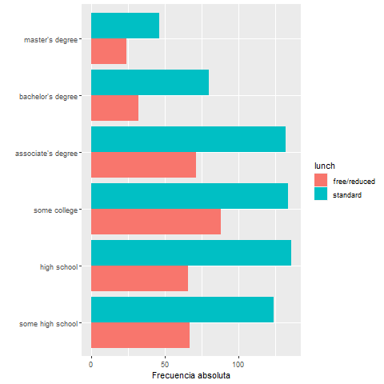
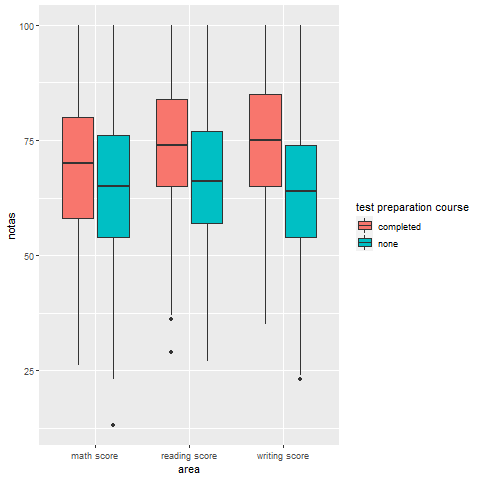
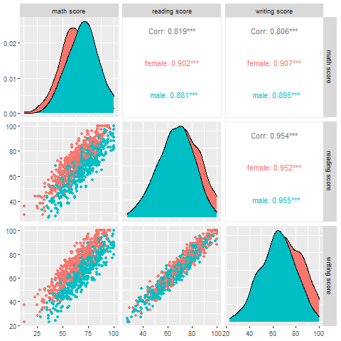

Nombre del grupo: Grupo NOMBRE

Autores

1. Apellidos, Nombre
2. Apellidos, Nombre
3. Apellidos, Nombre
4. Apellidos, Nombre
5. Apellidos, Nombre

**INSTRUCCIONES**


Comentarios:

* Para hacer los cálculos solicitados en los apartados anterior se deben eliminar los valores no  disponibles (`NA`) de las variables.

* Siempre que sea posible se deben utilizar las funciones de R explicadas en clase para resolver los ejercicios.

* Debe redactar un documento utilizando Rmarkdown con las respuestas a estas preguntas y que incluya el código R utilizado. También debe generar (Knit) una versión HTML del documento.


El documento, en formato .Rmd y .html o .pdf , se debe **entregar a Aula Digital antes del 22 de diciembre**. 


# Parte 1. Descripción de datos tidyverse


Considera el conjunto de datos `examenes.csv` que contiene las siguientes variables:

* `gender`: sexo del estudiante masculino ("male") o femenino ("female").

* `race/ethnicity`: raza del estudiante (grupos desde el A hasta el E).

* `parental level of education`: nivel educativo de los padres desde algo de estudios secundarios ("some high school") hasta master ("master degree").

* `lunch`: tipo de precio que paga el estudiante por la comida que recibe en el centro educativo: normal ("standard") o con descuento ("free/reduced").

* `test preparation course`: si el estudiante ha tomado un curso de preparación para el examen de acceso a la Universidad, dos posibles valores: lo completó ("completed"), no lo tomó ("none").

* `math score`: nota que obtuvo el estudiante en la parte de matemáticas del examen de acceso a la Universidad. Valores del 0 al 100, donde el 100 es la máxima puntuación.

* `reading score`: nota que obtuvo el estudiante en la parte de lectura del examen de acceso a la Universidad. Valores del 0 al 100, donde el 100 es la máxima puntuación.

* `writing score`: nota que obtuvo el estudiante en la parte de redacción del examen de acceso a la Universidad. Valores del 0 al 100, donde el 100 es la máxima puntuación.


A continuación te presento la estructura del conjunto de datos:

```{r, message=FALSE, warning=FALSE}
library(readr)
datos <- read_csv("data/examenes.csv")
library(tidyverse)
glimpse(datos)
```


## Cuestión 1.  **1 punto** 

a. Describe lo que se calcula con el siguiente código

```{r, eval=FALSE, results= "asis"}
datos <- drop_na(datos)
datos %>% group_by(gender)%>%
  summarise(frecuencia=length(gender))%>%
  mutate(porcentaje=frecuencia/sum(frecuencia)*100)
df<- datos %>% group_by(`race/ethnicity`) %>%
 summarise(frecuencia=length(`race/ethnicity`)) %>%
 arrange(desc(frecuencia)) 
df
```


b.  Da el código de ggplot2 que genera este gráfico. Comenta los resultados


```{r plot1, echo=FALSE,out.width="60%" , fig.align="center"}

```


## Cuestión 2. **1 punto**

Explica  lo que se obtiene en la tibble `df2` y dibuja y analiza  el gráfico que se genera en el contexto del problema.

```{r}
df2<- datos %>%
  tidyr::pivot_longer(
    cols=contains("score"),
    names_to="area", values_to="notas") %>%
  select("area", `test preparation course`, "notas")
```

```{r plot2, echo=FALSE, out.width="60%" , fig.align="center"}

```


## Cuestión 3. **1 punto** 

Genera el  gráfico (con `ggplot2`) e INTERPRETA  el siguiente gráfico 

```{r plot3,warning=FALSE, message=FALSE, out.width="60%", fig.align="center", echo=FALSE}

```


# Parte 2. Estadística Inferencial 


Nos piden analizar los datos de la [web de Airbnb](http://insideairbnb.com/get-the-data.html) para Mallorca de septiembre de 2022 y junio de 2022 (se adjuntan) los ficheros .

Cargad  en un `dataframe` los datos del fichero  `listings.csv` (descomprimido a partir de `listings.csv.gz`).

Vamos a cargar los datos y seleccionar  algunas variables `price, review_scores_rating` y `neighbourhood_cleansed`.

```{r}
#library(tidyverse)
data_june=readr::read_csv("data/listings_mallorca_june_2022.csv")# 
print(object.size(data_june),units="MB",stardard="SI")
#glimpse(data_june)
gsub(pattern="[\\$]|[,]",replacement="",data_june$price[1:10])
as.numeric(gsub(pattern="[\\$]|[,]",replacement="",data_june$price[1:10]))
data_june$price=as.numeric(gsub(pattern="[\\$]|[,]",replacement="",data_june$price))
head(data_june$price)
class(data_june$price)
data_june= data_june %>% select(price,review_scores_rating,neighbourhood_cleansed)
glimpse(data_june)
```


## Pregunta 1. **1 punto**
a.  Calcular una estimación puntual de la media para la variable `price` y el error estándar del estimador.
b.  Calcular un intervalo de confianza, al nivel de confianza del 95\%, para la variable `price`.


## Solución

## Pregunta 2.  **2 puntos**
 
a. Supongamos que un responsable de Airbnb asegura que  el porcentaje de los valores de `review_scores_rating` mayor o igual 
  que 4.5  es del 79.5% . Contrastad esta hipótesis con  los datos de Mallorca. 
b. Calcular un intervalo de confianza del 95% asociado a este contraste por el método exacto, el de Wilson y el Laplace.


## Solución

## Pregunta 3. **2 puntos**

Considera ahora los datos de `price` para  del mes junio de 2022  de las dos  zonas de Mallorca con más apartamentos vacacionales

```{r}
sort(table(data_june$neighbourhood_cleansed),decreasing = TRUE)[1:4]
```

a. Decidid si las varianzas   del precio  en las  dos zonas son iguales o diferentes. Considera que las distribuciones de los valores de precio en las poblaciones son normales.
b. Dad un intervalo de confianza del 95% para  comparar las varianzas. Interpretar adecuadamente el resultado.

## Solución

## Pregunta 4. **2 puntos**

a. A partir de los resultados del apartado anterior contrastad la hipótesis de que los precios medios en las dos ciudades son iguales contra que  son distintos.
b. Calcular un intervalo de confianza del 95% para la diferencia de precios.


## Solución

