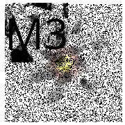

```{r setup, include=FALSE}
knitr::opts_chunk$set(echo = TRUE,cache=FALSE)
```
```{r fig.align='center',echo=FALSE,out.width="10%"}

```


# Taller evaluable datos FIFA 2023

Cada pregunta vale 1 punto menos las dos últimas que valen 1.5 puntos. Se puntúa la presentación, la claridad y que los dibujos están completos. Este taller está pensado para resolver con R-base  pero podéis utilizar tidyverse u otros paquetes de R.

En la web  de kaggle [FIFA23 OFFICIAL DATASET](https://www.kaggle.com/datasets/bryanb/fifa-player-stats-database). Contiene todos los data sets de  de datos básicos  de FIFA17 to FIFA23 del videojuego.

Las siguientes preguntas son relativas al data set `players_23.csv`, que se adjunta con la práctica. 

Hay que contestar con código R explicar  adecuadamente cada salida. Subid a la activad el Rmd y el html. 


Rellenad estos datos:

**PONED NOMBRE DEL GRUPO**

*  Florit Ensenyat, Jordi 
*  Ferrer Fernández, Marc 
*  Girón Rodríguez, Pau 
*  Fornés Reynés, Josep Gabriel 


##  Carga de datos

Tenéis que carga los datos con el código que se ve a continuación.  Visualizar y explorara el  data set y  averiguar de qué tipo son cada una de las variables y  en qué tipo de  fichero están guardadas.  El código carga los datos en un data frame llamado `datos`  con la función `read.csv`. Debéis entender clases  y tipos de datos de cada de cada columna de datos.  El parámetro `encoding` es necesario para cargar debidamente los acentos y caracteres especiales.
Lo que obtenemos es un data frame de 18539  observaciones (filas)  y 90  variables (columnas).

Cargaremos todas las  variables de texto como factor con el parámetro `stringsAsFactors = TRUE`

```{r}
datos = read.csv("players_fifa23.csv",
  encoding="UTF-8",stringsAsFactors = TRUE)# cambia tu path
#str(datos)
#names(datos)
```


Las variables de la 1 (`NationalTeam`) a la 31(`NationalPosition`) son variables de perfil del jugador: su nombre, su  equipo su sueldo su número de camiseta... El resto de variables de la 34 (`pace`) a la 90  (`rb`) son variables numéricas  enteras con valores de 0 a 100 que parametrizan cómo es el jugador el el juego FIFA player 2023.  


```{r echo=FALSE}
num=0
```


##  Pregunta `r num=num+1;num `

Las selecciones europeas que han ganado un mundial son 

```{r}
eur=c("England","France","Germany","Italy","Portugal","Spain")
eur
```

Generar un data frame con el nombre `fifa23_eur` con los jugadores de estas selecciones.

### Solución 1
```{r}
fifa23_eur = datos[datos$NationalTeam %in% eur,]
fifa23_eur$NationalTeam = droplevels(fifa23_eur$NationalTeam)
unique(fifa23_eur$Name)

```


##  Pregunta `r num=num+1;num `

Calcular la media y la desviación típica   del  valor de cada selección nacional cada equipo del data frame `fifa23_eur`. 

Calcular la media y la desviación típica  EN MILES de euros  del valor   de cada jugador `ValueEUR` de cada selección nacional del frame `fifa23_eur` por posición en el campo delantera media y defensa. 

### Solucion 2

Tabla con la media y la desviación tipica:
```{r}
tabla=as.data.frame(aggregate(ValueEUR~NationalTeam, data=fifa23_eur,
                      FUN=function(x){c(media=mean(x,na.rm = TRUE), desv.tip=sd(x,na.rm = TRUE))}))
tabla
```

```{r}
tabla2=as.data.frame(aggregate(ValueEUR~NationalTeam+NationalPosition, data=fifa23_eur,
                      FUN=function(x){c(media=mean(x/1000,na.rm = TRUE), 
                                        min=min((x/1000),na.rm=TRUE),
                                        max=max((x/1000),na.rm=TRUE),
                                        desv.tip=sd((x/1000),na.rm = TRUE))}))
tabla2

```


##  Pregunta `r num=num+1;num `

Discretiza la variable `ValueEUR` de  `fifa23_eur` en los 4 niveles siguientes: "Cuartil_1", "Cuartil_2", "Cuartil_3" y "Cuartil_4", según los cortes por  la función `quantile`para 0.25,0.5 y 0.75. La variable resultante Value_Level tiene que ser un factor ordenado en orden creciente de valor. 

### Solución 3

Consideramos la variable aleatoria X = "valor en € de los jugadores de las 5 selecciones europeas". Mostramos los cuartiles (0.25, 0.50, 0.75). Creamos la variable `cuartiles`para guardar en ella un factor dividido en los diferentes cuantiles, con la funcion break. Finalmente, creamos un facor igual a valor4 pero atribuyendo nombres a las columnas.
```{r}
quantile(fifa23_eur$ValueEUR,probs = c(0.25,0.5,0.75))
valor4=ordered(cut(fifa23_eur$ValueEUR,
                   breaks=c(0,quantile(fifa23_eur$ValueEUR,probs = c(0.25,0.5,0.75)),Inf)))


table(valor4)
Value_Level <- factor(valor4,labels=c("Cuartil_1", "Cuartil_2", "Cuartil_3" , "Cuartil_4"))
table(Value_Level)

```


##  Pregunta `r num=num+1;num `

¿Qué selección  tiene a más jugadores en  el intervalo de Valor  máximo  calculado en el ejercicio anterior?

Estudiad la función `droplevels` para quitar los niveles de las selecciones que no aparecen.

###   Solución 4

Podemos ver que la selección con los jugadores de más valor es Francia.
```{r}
table(valor4,droplevels(fifa23_eur$NationalTeam))

```


##  Pregunta `r num=num+1;num `

¿Respecto al tiro cuántos zurdos, diestros  y ambidiestros (3) (buscad qué variable es e interpretar su valor de 1 a 5) hay entre todos los jugadores de `fifa23_eur`? Construir una variable llamada `foot` que tenga por niveles "left",  "right","ambidextrous"   ¿Qué selección tiene mayor cantidad de zurdos (decidid que es zurdo diestro y ambidiestro)?

### Solución 5

Consideramos que la variable `WeakFoot` de los jugadores nos indica segun el nivel de dicha variable su pierna de tiro.
```{r}
table(fifa23_eur$WeakFoot)
```
Creamos la variable `foot` que contenga esos niveles. Determinamos que entre 1-2 el jugador usa la pierna izquierda "left", si el valor es 3 el jugador es ambidiestro "ambidextrous" y finalment entre 4-5 la pierna derecha "right" y en total hay los siguientes jugadores:
```{r}
fifa23_eur$foot = factor(ifelse(fifa23_eur$WeakFoot <= 2, "left", ifelse(fifa23_eur$WeakFoot == 3, "ambidextrous", "right")))
table(fifa23_eur$foot)
```
 
Finalmente observamos que la seleccion con mayor numero de zurdos es Alemania
```{r}
table(fifa23_eur$NationalTeam,fifa23_eur$foot)
```


##  Pregunta `r num=num+1;num `

Calcular la la tabla de contingencia (frecuencias absolutas) por posición  `NationalPosition` contra  `foot`. contingencia con  las variable `foot`. Calcular la tabla global  de proporciones de `NationalPosition` y  `foot`. Calcular la tabla  de proporciones marginales de `foot` por (condicionada a) `NationalPosition`.

### Solución 6

```{r}
tabla1 = table(fifa23_eur$NationalPosition,fifa23_eur$foot)
tabla1

tabla2 = prop.table(tabla1)
tabla2
```


##  Pregunta `r num=num+1;num `

Calcular diagramas de barras adosados para la primera tabla del ejercicio anterior y un diagrama de mosaico de la segunda  tabla. Poned una leyenda  y nombre del gráfico  y comentar los resultados con un pequeño párrafo.

### Solución 7

```{r}
barplot(tabla1,beside=TRUE,col=c("red","purple","yellow"))
legend("topleft",col=c("red","purple","yellow"),legend=c("Right", "Ambidextrous", "Left"),lwd=3,bty="l",cex=0.8)
plot(fifa23_eur$foot,fifa23_eur$NationalPosition)
```


##  Pregunta `r num=num+1;num `

Comparar la distribución del  score `Overall`  con un `boxplot` para las 6 selecciones. Decorar adecuadamente el resultado. Comentar los resultados.

## Solución 8 

```{r}
boxplot(fifa23_eur$Overall~fifa23_eur$NationalTeam)
```


##  Pregunta `r num=num+1;num `

Generar un data frame `fifa23_ame`  que contenga exclusivamente a  las 6  selecciones de América que van al mundial 2022.

```{r}
ame=c("Argentina","Brazil","Canada","Mexico","Ecuador","United States" )
```

Generar un data frame `fifa23_ame`. Comparar la distribución del  score `overall` para TODOS los jugadores de las 6 selecciones de europa  y  TODOS los jugadores de las seis selecciones de América. Dibujando un histograma con la función *kernel* en un solo gráfico. Comentar los resultados.

### Solución 9

```{r}
fifa23_ame=datos[datos$NationalTeam %in% ame,]
fifa23_ame$NationalTeam = droplevels(fifa23_ame$NationalTeam)
unique(fifa23_ame$NationalTeam)
```

```{r}
plot(density(fifa23_eur$Overall),col="red",xlim=c(60,100))
lines(density(fifa23_ame$Overall),col="blue")
legend("topleft",col=c("red","blue"), legend=c("eur","ame"),lwd=3,bty="l",cex=0.8)
```

